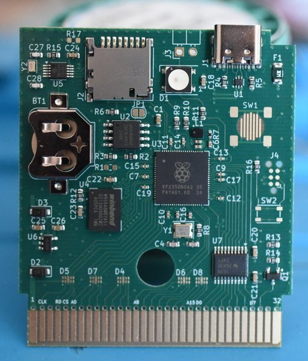

# Firmware for the RP2350B based Gameboy cartridge (Croco Cartridge V2)
Utilizing the power of PIO to create a open-source flashcartridge for the gameboy


## How to play ROMs on the cartridge
Format a sd card with FAT32 and put the ROMs into the root folder of the cartridge. Put the sd card into the cartridge and put that into the Gameboy.
Select the ROM you want to play in the menu and press A.

## How to build
Open repository in VS Code with the [Dev Containers](https://marketplace.visualstudio.com/items?itemName=ms-vscode-remote.remote-containers) 
addon installed. VS Code should ask if it shall open the workspace in the devcontainer. 

Open terminal in VS Code and build with Cargo:
```
cargo build --release
```

## How to flash the firmware
You can upload the new firmware via USB. The firmware is able to receive commands from picotool and jumps into the Pico bootloader.
This command will send the cartridge into bootloader and flashes a new ELF from an official release or custom build:
```
picotool load -u -v -x -t elf target/thumbv8m.main-none-eabihf/release/rp2350-gameboy-cartridge -f
```

## How does it work?
The ROM is loaded from the sd card to the Hyperram connected to he microcontroller.
The RP2350B has 12 PIO state-machines which are like small co-processors which can run arbitrary code. They are designed to be efficient in IO operations.
Which is what they are mostly doing in this cartridge. They follow the Gameboy cartridge parallel bus interface and detect if the cartridge needs
to spit out or receive some data. Those requests are forwarded to the ARM core through the FIFOs. There a cascade of DMAs will happily handle those
requests by fetching the data from the Hyperram.

## How do savegames work?
In original cartridges the savegames had been stored in a RAM which was using a coin cell battery to hold the data while the gameboy is switched off.
This has pros and cons. One of the biggest cons is that the savegame is lost if the battery dies. There was a big discussion on heartbroken users 
as the savegame of their beloved childhood Pokemon Blue/Red/Yellow was gone after 20 years. One has to remember that they started selling in 1998.
The biggest pro on the savegame RAM is that the save is instantaneous. And that is what the games expect. They do not wait for the save to be done.

Why this explanation? A sd card might not have those battery limitations on one side, but writing something to it takes a lot more time. This is why the
cartridge cannot store the savegame immedietly to the sd card. The button on the cartridge is used to trigger the storing of it. It will save the savegame 
to the sd card. This will not interrupt the Gameboy in any way. That is why there is a plan to do this periodically with a fixed time in the future, but this
is not implemented yet.

## How to setup the RTC?
There is a battery driven RTC on the cartridge which advances the clock while the Gameboy is off. The time needs to be setup initially. In the main menu (there
the list of ROMs is seen) press select and in this menu select RTC config. It's best to set this time to UTC, as this makes the savegames compatible to emulators
on PCs. I plan to implement timezone support in the future to make it more user friendly.

If no ROMs with RTC support are played there is no need to setup the RTC. The cartridge functions also without the coin-cell battery.

## Does LSDJ work?
Yes. 128k saves are supported. With the newest releases it also runs on the GBC.

## How can I get the needed hardware?
Find the Kicad project files in this [repo](https://github.com/shilga/rp-gameboy-cartridge-hw/tree/master/KiCad/V2/GameboyCartridgeV2.1). Or order one on [Tindie](https://www.tindie.com/products/zeraphim/rp2350b-based-gameboy-cartridge/).


## Discord
Find the Discord server to get help or discuss about this project. <https://discord.com/invite/jxGfqw2mdt>
